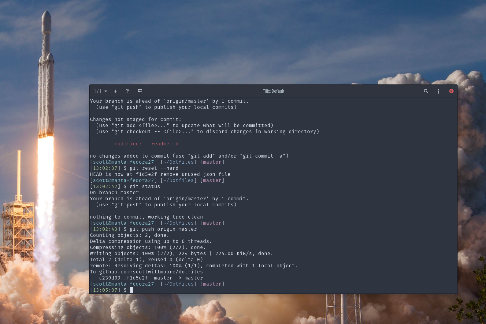

# Dotfiles



These are my personal dotfiles for Windows and Linux. It currently includes configurations for:

-   Bash
-   Git
-   PowerShell
-   Starship
-   Tmux
-   Vim
-   VsVim
-   Windows Terminal

Some notable features include Vim-like keybindings in Bash, PowerShell and Windows Terminal. A minimal Vim configuration for quick edits and SSH sessions. An awesome, efficient, personally-customized terminal prompt provided by Starship. A Gruvbox themed, light and dark themed Windows Terminal.

I use the VsVim plugin for Visual Studio and I use the Vim plugin for Visual Studio Code. My Visual Studio Code settings and extensions are synced with the new 'Settings Sync' feature and are linked with my GitHub account. I have also been experimenting with Neovim, however I am sadly still finding it difficult to replace the support and features provided by Visual Studio Code.

## Install

To use `install.py` Python 3 is required. The script should work on both Windows and POSIX compatible systems. In addition, the script should not require administator privileges on Windows provided that [Developer Mode](https://docs.microsoft.com/en-us/windows/apps/get-started/enable-your-device-for-development) is enabled and Python 3.8 or greater is used.

```
git clone git@github.com:scottwillmoore/dotfiles ~/Dotfiles
cd ~/Dotfiles
python ./install.py --verbose
```
